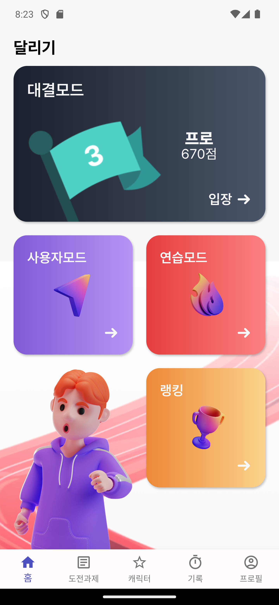
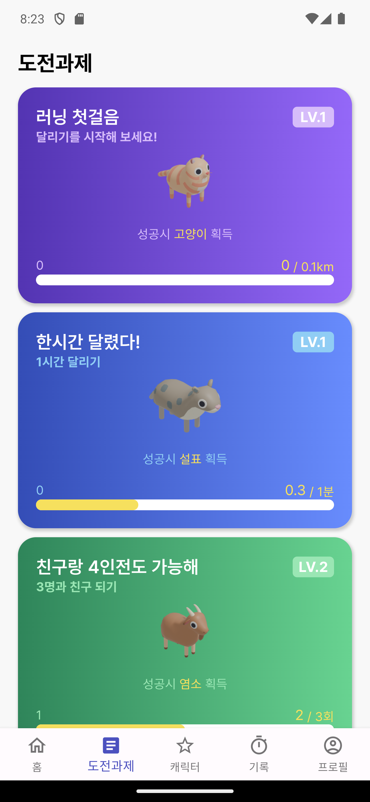
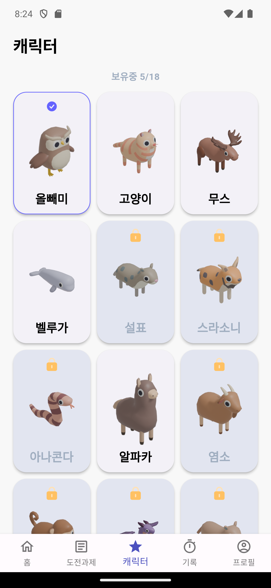
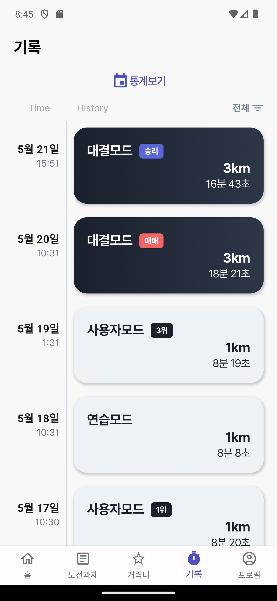
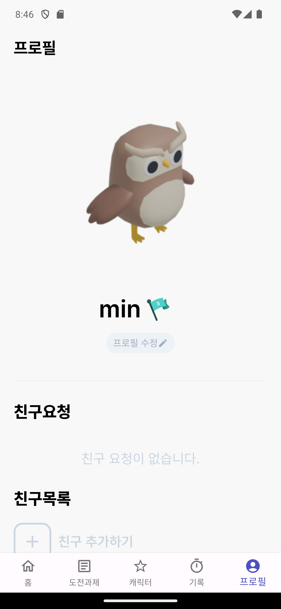
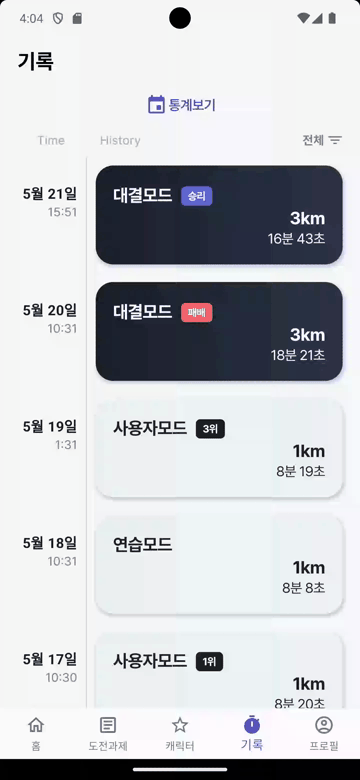
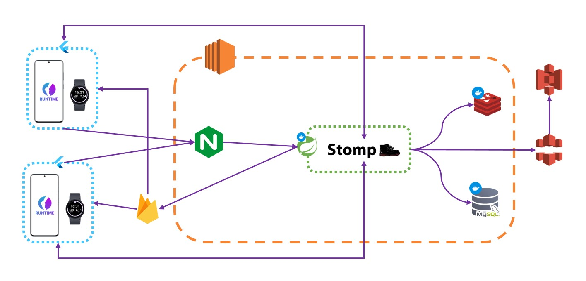
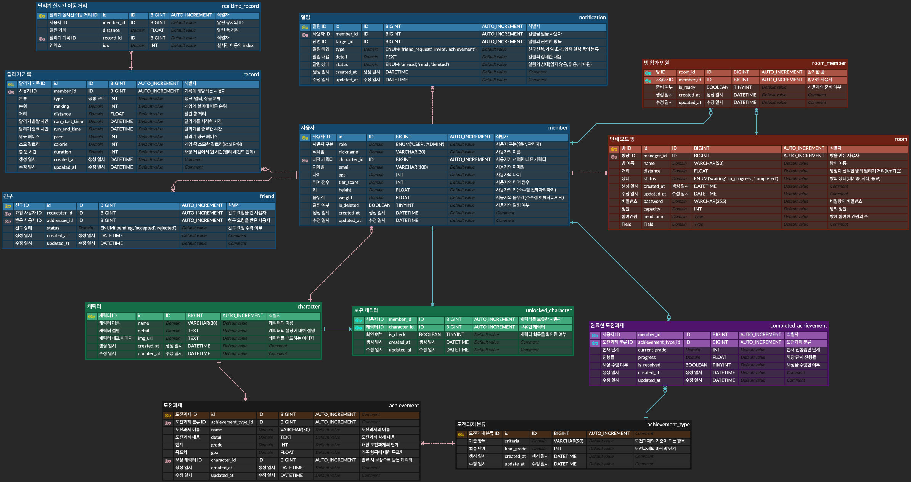

# RunTime

기간 : 2024. 4. 8. ~ 2024. 5. 20. (6주)  
인원 : 6명

 

## 📌 개요

혼자 달리는 것보다는 함께 달리는 것이 더 좋습니다. 실제로 마라톤의 참여도 계속해서 증가하고 있습니다. 하지만 시간과 공간의 제약이 있어 어려움이 있습니다. **RunTime** 통해서 언제 어디서든 재미있게 달려볼 수 있습니다!

런태기에 빠진 당신, 새로운 사람과 함께 달려 보세요!

    

## 📝 개발문서

### [🗂️ Notion](https://www.canva.com/design/DAGFmV6lXAQ/Rg9sqL3HsB8Cd2hkAiNP4w/edit?utm_content=DAGFmV6lXAQ&utm_campaign=designshare&utm_medium=link2&utm_source=sharebutton)

### [🖥️ Presention](https://www.canva.com/design/DAGFmV6lXAQ/Rg9sqL3HsB8Cd2hkAiNP4w/edit?utm_content=DAGFmV6lXAQ&utm_campaign=designshare&utm_medium=link2&utm_source=sharebutton)

    

## 🔧 기술스택

### Front-End

  

### Back-End
   

### DB
  

### Infra
  

    

## 📱 주요기능

- 실시간 매칭을 통한 상대방과의 3km 달리기 배틀!
- 티어별 매칭 시스템을 통해 나와 비슷한 상대와 뛰어 보세요!
- 화면을 보지 않아도 음성 중계 기능을 통해 달리기 상황을 실시간으로 들어 보세요!
- 달리기 통계를 통해 내 달리기 실력을 가늠해 보세요!

  

### 0. 페이지 개요

|**메인화면**|**도전과제**|**캐릭터**|**기록**|**프로필**|
| :---: | :---: | :---: | :---: | :---: | 
|  |  |  |  |  |

    

### 1. 스플래시 및 로그인화면
- 소셜 로그인(카카오)

|**스플래시**|**로그인**|
| :---: | :---: | 
|||

    

### 2. 대결모드
- 대결모드 입장 후 대결 상대 찾기(실시간 매칭)
- 대결 상대가 매치된 후, 양 쪽 수락 시 대결 진행
- 해당 대결은 종료된 이 후, 티어 및 순위에 영향을 줄 수 있음

|**대결상대 찾기**|**매칭 성공**|
| :---: | :---: | 
|||

    

### 3. 사용자모드
- 최대 4인까지 여러 사용자와 달리기 가능

|**방 입장**|**방 만들기**|
| :---: | :---: | 
|||

    

### 4. 연습모드 및 랭킹
- 혼자 달릴 수 있는 개인 연습 모드
- 모든 사용자의 티어 점수에 따라 실시간으로 반영되는 랭킹

|**연습모드 입장**|**랭킹보기**|
| :---: | :---: | 
|||

    

### 5. 도전과제 및 캐릭터
- 서비스 이용 및 달리기를 통해 도전과제 수행
- 도전과제로 귀여운 캐릭터를 보상으로 받고 개인 프로필 캐릭터로 설정할 수 있다.

|**도전과제 보상받기**|**대표캐릭터 변경**|
| :---: | :---: | 
|||

    

### 6. 기록 및 통계
- 달리기의 기록정보를 볼 수 있다. 대결모드의 승패여부와 사용자모드 순위 등 다양한 정보들을 볼 수 있다.
- 월/연간 및 전체 통계를 확인할 수 있다.

|**기록보기**|**통계보기**|
| :---: | :---: | 
|||

    

### 7. 프로필 및 친구
- 프로필 수정 및 친구기능

|**프로필 수정**|**친구수락 및 친구추가**|
| :---: | :---: | 
|||

### 8. 점수 티어표

    

## 🏗️ 아키텍처

    

## ⚙️ ERD

    

## 👥 팀원소개

| [박정호](https://github.com/cuzzzu1318) | [박예지](https://github.com/yeji0517) | [이현민](https://github.com/hyunmin2667) | [조우재](https://github.com/Jo-dv) | [조창래](https://github.com/crcho5133) | [최도훈](https://github.com/Dohun-choi) |
| :---: | :---: | :---: | :---: | :---: | :---: |
|||||||
| Leader BE Infra | Full Stack | Full Stack  | BE | BE | FE |
| API Security CI/CD | Flutter wearOS | API Flutter Design Presentation | API Assets&Resource Landing Site | API Socket Game | Flutter Socket Game |

