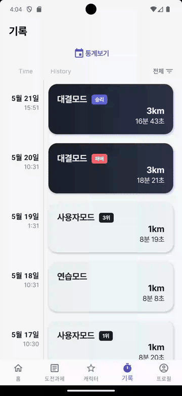
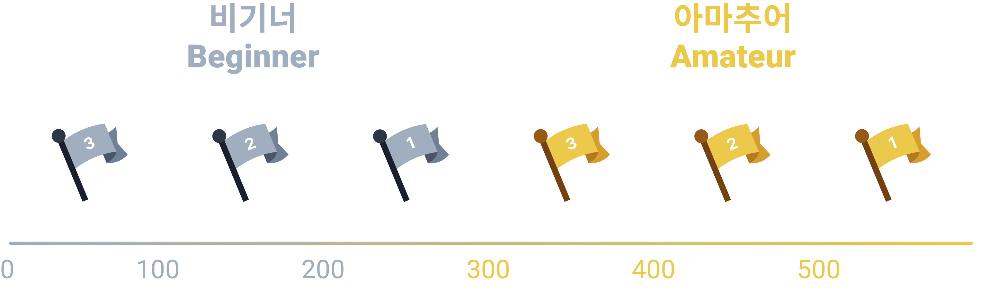
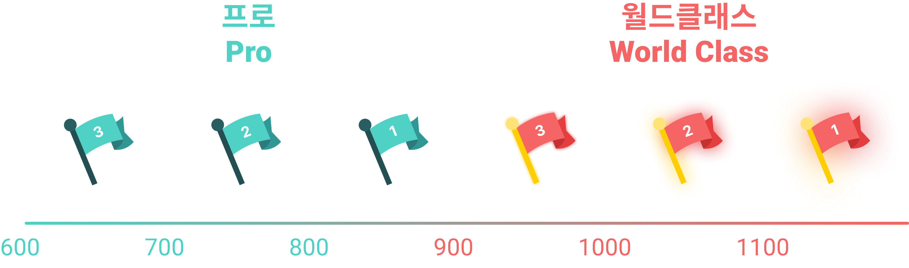

# RunTime
달릴 시간이야!

    

## 개요
> 런태기에 빠진 당신, 새로운 사람과 함께 달려 보세요!

    

## 산출물

  
  <a href="https://www.notion.so/0ff20d1b3bd845f88c093033ba97a451">Notion</a>

    

## 기술 스택

### Front-End

### Back-End

### DB

### Infra

    

## 주요 기능

### 대결모드

|**대결상대 찾기**|**매칭 성공**|
| :---: | :---: | 
|||

### 사용자모드

|**방 입장**|**방 만들기**|
| :---: | :---: | 
|||

### 연습모드 및 랭킹

|**연습모드 입장**|**랭킹보기**|
| :---: | :---: | 
|||

### 도전과제 및 캐릭터

|**도전과제 보상받기**|**대표캐릭터 변경**|
| :---: | :---: | 
|||

### 기록 및 통계

|**기록보기**|**통계보기**|
| :---: | :---: | 
|||

<!--  -->
- 실시간 매칭을 통한 상대방과의 3km 달리기 배틀!
- 티어별 매칭 시스템을 통해 나와 비슷한 상대와 뛰어 보세요!
- 화면을 보지 않아도 음성 중계 기능을 통해 달리기 상황을 실시간으로 들어 보세요!
- 달리기 통계를 통해 내 달리기 실력을 가늠해 보세요!
### 커스텀 게임

- 최대 4인 플레이가 가능한 커스텀 게임
- 친구를 초대하여 친구와 함께 즐겨 보세요!

### 티어 및 랭킹

<!--  -->
- 티어를 올리기 위해 더 열심히 달려 보세요!
- 상위 랭킹에 도전!

<!-- 
### 도전과제 및 캐릭터

- 약 20 종의 귀여운 캐릭터!
- 도전과제를 완료해 캐릭터를 얻어 보세요!
- 획득 방법이 알려지지 않은 히든 캐릭터도..? -->

    

## 아키텍처

    

## 팀원 소개

| [박정호](https://github.com/cuzzzu1318) | [박예지](https://github.com/yeji0517) | [이현민](https://github.com/hyunmin2667) | [조우재](https://github.com/Jo-dv) | [조창래](https://github.com/crcho5133) | [최도훈](https://github.com/Dohun-choi) |
| :---: | :---: | :---: | :---: | :---: | :---: |
|||||||
| Leader BE Infra | Full Stack | Full Stack  | BE | BE | FE |
| API Security CI/CD | Flutter wearOS | API Flutter Design Presentation | API Assets&Resource Landing Site | API Socket Game | Flutter Socket Game |

